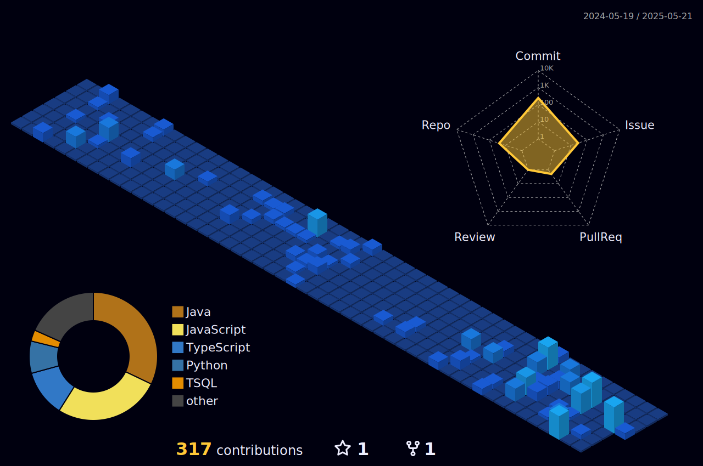

# 🧑🏻‍💻 `     Hello World!     ` 🌍

_Sou estudante de Análise e Desenvolvimento de Sistemas (FATEC ZL), apaixonado por desenvolvimento web, dados e tecnologia como ferramenta de transformação._  
_Tenho formação técnica em Edificações, mas encontrei no código minha verdadeira vocação._  
_Atualmente desenvolvo projetos fullstack e busco aplicar meus conhecimentos em soluções reais que impactem positivamente o mundo._

  
  
  
    🔍
    
  

---

### 🔸 `Tecnologias` 📚

| 💡 **HTML**  | 🎨 **CSS**  | ⚙️ **JavaScript**  | ☕ **Java**  | ⚛️ **React.js**  | 🛠 **Node.js**  |
| :---------------------------------------------------------------------------------------------------------------------------------------------------------------- | :------------------------------------------------------------------------------------------------------------------------------------------------------------ | :-------------------------------------------------------------------------------------------------------------------------------- | :------------------------------------------------------------------------------------------------------------------------------------------------- | :--------------------------------------------------------------------------------------------------------------------------------------------------------------------- | :-------------------------------------------------------------------------------------------------------------------------------------------------------------------- |

| 🗄 **SQL / MongoDB**  | 🧩 **Express.js**  | ⚙️ **Sequelize**  | 🌱 **Spring Boot**  | 🐧 **Linux**  | 🔁 **Scrum / Kanban** | 

---

### 🔸 `Estatísticas` 📊

  
  
  

---

---

> _"Tecnologia é ponte, não muro. Código é ferramenta, não fim."_ 🚀
